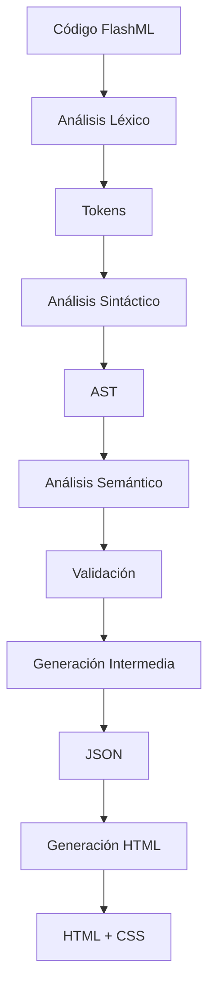

# ⚡ CompiladorFlashML

<div align="center">


**Un compilador temático inspirado en The Flash que transforma código FlashML a HTML semántico**

[Características](#-características) • [Instalación](#-instalación) • [Uso](#-uso) • [Sintaxis](#-sintaxis-flashml) • [API](#-api) • [Contribuir](#-contribuir)

</div>

---

## 🌟 Descripción

**FlashML** es un lenguaje de marcado innovador inspirado en la velocidad y dinamismo de _The Flash_. Este compilador transforma código FlashML en HTML semántico con estilos temáticos, ofreciendo una experiencia de desarrollo única para crear páginas web con una estética del universo DC Comics.

### ✨ ¿Qué hace especial a FlashML?

- **🚀 Sintaxis temática**: Utiliza etiquetas como `@velocista`, `@temporada`, `@personaje` y `@superspeed`
- **⚡ Compilación rápida**: Análisis léxico, sintáctico y semántico en tiempo real
- **🎨 Estilos automáticos**: Genera CSS inspirado en The Flash automáticamente
- **🌐 Interfaz web**: Editor integrado con resaltado de sintaxis
- **📱 Responsive**: Output HTML completamente responsive
- **🔧 Extensible**: Fácil de modificar y extender

## 🎯 Características

### Compilador Completo
- **Análisis Léxico**: Tokenización completa del código FlashML
- **Análisis Sintáctico**: Construcción de AST (Árbol de Sintaxis Abstracta)
- **Análisis Semántico**: Validación de estructura y semántica
- **Generación de Código**: Output HTML optimizado con CSS integrado

### Interfaz Web Moderna
- **Editor CodeMirror**: Resaltado de sintaxis personalizado para FlashML
- **Vista previa en tiempo real**: Compilación y visualización instantánea
- **Gestión de archivos**: Historial de compilaciones generadas
- **Interfaz responsive**: Diseño adaptable inspirado en The Flash

### Tecnologías Integradas
- **Backend**: Flask (Python 3.8+)
- **Frontend**: HTML5, CSS3, JavaScript, TailwindCSS
- **Editor**: CodeMirror con modo personalizado FlashML
- **Arquitectura**: MVC con separación clara de responsabilidades

## 🚀 Instalación

### Requisitos Previos

- **Python 3.8 o superior**
- **pip** (gestor de paquetes de Python)
- **Git** (opcional, para clonar el repositorio)

### Instalación Rápida

```bash
# Clonar el repositorio
git clone https://github.com/tu-usuario/CompiladorFlashML.git
cd CompiladorFlashML

# Crear entorno virtual (recomendado)
python -m venv venv

# Activar entorno virtual
# En Windows:
venv\Scripts\activate
# En macOS/Linux:
source venv/bin/activate

# Instalar dependencias
pip install flask

# Ejecutar la aplicación
python app.py
```

### Instalación Manual

1. **Descargar el proyecto**
   ```bash
   git clone https://github.com/tu-usuario/CompiladorFlashML.git
   cd CompiladorFlashML
   ```

2. **Configurar Python**
   ```bash
   python -m venv flashml_env
   source flashml_env/bin/activate  # Linux/macOS
   flashml_env\Scripts\activate     # Windows
   ```

3. **Instalar Flask**
   ```bash
   pip install flask
   ```

4. **Ejecutar aplicación**
   ```bash
   python app.py
   ```

5. **Acceder a la interfaz**
   - Abrir navegador en `http://localhost:5000`

## 💻 Uso

### Interfaz Web

1. **Acceder al compilador**
   ```
   http://localhost:5000
   ```

2. **Escribir código FlashML**
   - Usa el editor integrado con resaltado de sintaxis
   - Ejemplo básico:
   ```flashml
   @velocista
     @titulo Central City @/titulo
     @personaje nombre="Barry Allen"
       El velocista escarlata está aquí
     @/personaje
   @/velocista
   ```

3. **Compilar**
   - Presiona "Compilar" o `Ctrl+Enter`
   - Ve el resultado HTML generado
   - Descarga el archivo compilado

### Línea de Comandos

```bash
# Compilar un archivo FlashML
python main.py archivo.flashml

# Especificar archivo de salida
python main.py archivo.flashml -s salida.html

# Ver ayuda
python main.py --help
```

### API Programática

```python
from main import compilar_codigo

# Compilar código FlashML directamente
codigo_flashml = """
@velocista
  @titulo Mi Historia Flash @/titulo
  @superspeed Velocidad infinita @/superspeed
@/velocista
"""

resultado = compilar_codigo(codigo_flashml)
if resultado['html']:
    print("Compilación exitosa!")
    with open('output.html', 'w') as f:
        f.write(resultado['html'])
else:
    print("Errores:", resultado['errores'])
```

## 📝 Sintaxis FlashML

### Estructura Básica

```flashml
@velocista
  ## Comentario en FlashML ##
  @titulo Título de mi página @/titulo
  @temporada numero="1"
    @episodio
      @escena
        @personaje nombre="Barry Allen" actor="Grant Gustin"
          Contenido del personaje
        @/personaje
      @/escena
    @/episodio
  @/temporada
@/velocista
```

### Etiquetas Principales

| Etiqueta FlashML | HTML Generado | Descripción |
|-----------------|---------------|-------------|
| `@velocista` | `<div class="velocista">` | Contenedor principal |
| `@titulo` | `<h1>` | Títulos principales |
| `@temporada` | `<article>` | Secciones de temporada |
| `@episodio` | `<section>` | Episodios individuales |
| `@escena` | `<section>` | Escenas dentro de episodios |
| `@personaje` | `<figure>` | Personajes con información |
| `@dialogo` | `<p>` | Diálogos de personajes |
| `@accion` | `<aside>` | Descripciones de acción |
| `@imagen` | `` | Imágenes |
| `@villanos` | `<ul>` | Lista de villanos |
| `@villano` | `<li>` | Villano individual |

### Etiquetas de Poder

| Etiqueta | Descripción | Estilo CSS |
|----------|-------------|------------|
| `@superspeed` | Super velocidad | Efecto de velocidad |
| `@phasing` | Atravesar objetos | Efecto de transparencia |
| `@timetravel` | Viaje en el tiempo | Efecto temporal |
| `@speedforce` | Fuerza de velocidad | Efecto de energía |
| `@vibration` | Vibración molecular | Efecto de vibración |
| `@cryokinesis` | Poderes de hielo | Efecto de frío |
| `@metahuman` | Metahumano | Efecto especial |

### Atributos Soportados

```flashml
@personaje nombre="Barry Allen" actor="Grant Gustin" velocidad="mach 3"
@temporada numero="1"
@imagen src="flash.jpg" alt="The Flash"
@lugar nombre="Central City"
@equipo nombre="Team Flash"
```

### Comentarios

```flashml
## Este es un comentario en FlashML ##
@titulo 
  ## Los comentarios pueden estar en cualquier lugar ##
  Mi título
@/titulo
```

## 🏗️ Arquitectura

### Estructura del Proyecto

```
CompiladorFlashML/
├── 📁 Analizadores/          # Núcleo del compilador
│   ├── lexer.py             # Análisis léxico
│   ├── parser.py            # Análisis sintáctico  
│   ├── semantic.py          # Análisis semántico
│   ├── generator.py         # Generación HTML
│   └── intermedio.py        # Código intermedio
├── 📁 static/               # Recursos estáticos
│   ├── 📁 Css/
│   ├── 📁 Js/
│   └── 📁 generados/        # Archivos compilados
├── 📁 templates/            # Plantillas HTML
│   ├── index.html           # Interfaz principal
│   └── documentation.html   # Documentación
├── app.py                   # Servidor Flask
├── main.py                  # CLI del compilador
└── README.md               # Este archivo
```

### Flujo de Compilación



### Componentes Principales

#### 1. **Analizador Léxico** (`lexer.py`)
- Tokeniza el código FlashML
- Maneja etiquetas, atributos, texto y comentarios
- Reporta errores de sintaxis léxica

#### 2. **Analizador Sintáctico** (`parser.py`)
- Construye el AST (Árbol de Sintaxis Abstracta)
- Valida la estructura jerárquica
- Maneja anidamiento de etiquetas

#### 3. **Analizador Semántico** (`semantic.py`)
- Valida reglas semánticas del lenguaje
- Verifica coherencia de atributos
- Detecta referencias inválidas

#### 4. **Generador HTML** (`generator.py`)
- Convierte AST a HTML semántico
- Genera CSS automático temático
- Añade interactividad JavaScript

## 🔧 API

### Endpoints REST

#### `POST /compilar`
Compila código FlashML a HTML

**Request:**
```json
{
  "codigo": "@velocista\n  @titulo Mi página @/titulo\n@/velocista"
}
```

**Response (Éxito):**
```json
{
  "success": true,
  "html_path": "generados/output_1234567890.html",
  "intermedio_path": "generados/output_1234567890.json"
}
```

**Response (Error):**
```json
{
  "success": false,
  "errores": [
    {
      "tipo": "sintáctico",
      "mensaje": "Etiqueta de cierre no encontrada para @velocista"
    }
  ]
}
```

#### `GET /archivos`
Lista archivos generados

**Response:**
```json
{
  "archivos": [
    {
      "nombre": "output_1234567890.html",
      "tamano": "15.2 KB",
      "fecha": "2024-01-15 14:30:25",
      "path": "generados/output_1234567890.html"
    }
  ]
}
```

#### `GET /output/<filename>`
Sirve archivos generados

### Funciones Python

#### `compilar_codigo(codigo_fuente, archivo_entrada, archivo_salida)`
```python
def compilar_codigo(codigo_fuente, archivo_entrada="entrada.flashml", archivo_salida=None):
    """
    Compila código FlashML a HTML
    
    Args:
        codigo_fuente (str): Código FlashML como string
        archivo_entrada (str): Nombre del archivo de entrada
        archivo_salida (str): Ruta al archivo HTML de salida
    
    Returns:
        dict: {
            'html': str | None,           # Código HTML generado
            'intermedio': str | None,     # Ruta al archivo JSON
            'errores': list              # Lista de errores
        }
    """
```

#### `compilar_archivo(archivo_entrada, archivo_salida)`
```python
def compilar_archivo(archivo_entrada, archivo_salida=None):
    """
    Compila un archivo FlashML a HTML
    
    Args:
        archivo_entrada (str): Ruta al archivo FlashML
        archivo_salida (str): Ruta al archivo HTML de salida
    
    Returns:
        dict: Resultado de la compilación
    """
```

## 🛠️ Desarrollo

### Configuración del Entorno de Desarrollo

```bash
# Clonar y configurar
git clone https://github.com/tu-usuario/CompiladorFlashML.git
cd CompiladorFlashML

# Crear entorno virtual
python -m venv dev-env
source dev-env/bin/activate  # Linux/macOS
dev-env\Scripts\activate     # Windows

# Instalar dependencias de desarrollo
pip install flask

# Ejecutar en modo desarrollo
export FLASK_ENV=development  # Linux/macOS
set FLASK_ENV=development     # Windows
python app.py
```

### Ejecutar Pruebas

```bash
# Probar compilador CLI
python main.py ejemplos/test.flashml

# Probar servidor web
python app.py
# Navegar a http://localhost:5000
```

### Estructura para Nuevas Características

1. **Nuevas etiquetas**: Modificar `generator.py` en `mapeo_etiquetas`
2. **Nuevos atributos**: Actualizar `mapeo_atributos` y validación semántica
3. **Nuevos estilos**: Extender `_generar_estilos()` en el generador
4. **Nueva sintaxis**: Modificar lexer y parser según necesidad

### Contribuir

1. **Fork** el repositorio
2. **Crear** una rama feature (`git checkout -b feature/nueva-caracteristica`)
3. **Commit** cambios (`git commit -am 'Añadir nueva característica'`)
4. **Push** a la rama (`git push origin feature/nueva-caracteristica`)
5. **Crear** Pull Request

## 📄 Ejemplos

### Ejemplo Básico

**Código FlashML:**
```flashml
@velocista
  @titulo Central City Chronicles @/titulo
  @temporada numero="1"
    @episodio
      @escena
        @personaje nombre="Barry Allen" actor="Grant Gustin"
          @dialogo ¡Soy el hombre más rápido del mundo! @/dialogo
          @superspeed Corre a la velocidad de la luz @/superspeed
        @/personaje
        @villano @rapido Zoom @/rapido ha llegado a Central City @/villano
      @/escena
    @/episodio
  @/temporada
@/velocista
```

**HTML Generado:**
```html
<!DOCTYPE html>
<html lang="es">
<head>
    <meta charset="UTF-8">
    <meta name="viewport" content="width=device-width, initial-scale=1.0">
    <title>Documento FlashML</title>
    <style>
        /* Estilos automáticos temáticos de The Flash */
        .velocista { 
            background: linear-gradient(135deg, #cc0000, #ffcc00);
            color: white;
            font-family: 'Arial', sans-serif;
        }
        .superspeed {
            animation: lightning-flash 0.5s infinite;
            color: #ffcc00;
            font-weight: bold;
        }
        /* ... más estilos automáticos ... */
    </style>
</head>
<body>
    <div class="velocista">
        <h1>Central City Chronicles</h1>
        <article class="temporada" data-temporada="1">
            <section class="episodio">
                <section class="escena">
                    <figure class="personaje" data-nombre="Barry Allen" data-actor="Grant Gustin">
                        <p class="dialogo">¡Soy el hombre más rápido del mundo!</p>
                        <span class="superspeed">Corre a la velocidad de la luz</span>
                    </figure>
                    <li class="villano"><em class="rapido">Zoom</em> ha llegado a Central City</li>
                </section>
            </section>
        </article>
    </div>
</body>
</html>
```

### Ejemplo Avanzado

```flashml
@velocista
  @titulo The Flash: Multiverso @/titulo
  
  ## Temporada 1 ##
  @temporada numero="1"
    @episodio
      @lugar nombre="Central City"
        @escena
          @personaje nombre="Barry Allen" actor="Grant Gustin"
            @dialogo Mi nombre es Barry Allen @/dialogo
            @superspeed
              Soy el hombre más rápido del mundo
            @/superspeed
          @/personaje
          
          @accion
            Barry corre por las calles usando @speedforce
          @/accion
          
          @villanos
            @villano @rapido Reverse Flash @/rapido @/villano
            @villano Captain Cold con @cryokinesis @/villano
          @/villanos
        @/escena
      @/lugar
    @/episodio
  @/temporada
  
  @imagen src="team-flash.jpg" alt="Equipo Flash" @/imagen
@/velocista
```

## 🐛 Solución de Problemas

### Errores Comunes

#### Error: "Etiqueta de cierre no encontrada"
```
Error sintáctico: Etiqueta de cierre no encontrada para @velocista
```
**Solución:** Asegúrate de que cada etiqueta abierta tenga su correspondiente cierre:
```flashml
@velocista
  @titulo Mi título @/titulo  <!-- ✓ Correcto -->
@/velocista
```

#### Error: "Comilla de cierre no encontrada"
```
Error léxico: Comilla de cierre no encontrada en la posición 3:15
```
**Solución:** Verifica que todos los atributos tengan comillas balanceadas:
```flashml
@personaje nombre="Barry Allen" actor="Grant Gustin"  <!-- ✓ Correcto -->
@personaje nombre="Barry Allen actor="Grant Gustin"   <!-- ✗ Incorrecto -->
```

#### Error: "Puerto en uso"
```
OSError: [Errno 98] Address already in use
```
**Solución:** Mata el proceso anterior o usa otro puerto:
```bash
# Matar proceso en puerto 5000
kill -9 $(lsof -t -i:5000)

# O usar otro puerto
app.run(port=5001)
```

### Logs y Debugging

Los logs se guardan en `compilador_flashml.log`:
```bash
# Ver logs en tiempo real
tail -f compilador_flashml.log

# Buscar errores específicos
grep "ERROR" compilador_flashml.log
```

## 📚 Recursos Adicionales

### Documentación Completa
- **Interfaz web**: `http://localhost:5000/documentation`
- **Ejemplos**: Carpeta `ejemplos/` (si existe)
- **Tests**: Carpeta `tests/` (para implementar)

### Links Útiles
- [Flask Documentation](https://flask.palletsprojects.com/)
- [CodeMirror Documentation](https://codemirror.net/doc/manual.html)
- [TailwindCSS Documentation](https://tailwindcss.com/docs)

### Roadmap Futuro
- [ ] Sistema de plugins
- [ ] Más etiquetas temáticas
- [ ] Exportación a otros formatos
- [ ] IDE integrado
- [ ] Compilación en la nube
- [ ] Templates predefinidos
- [ ] Sistema de temas

## 📄 Licencia

Este proyecto está licenciado bajo la Licencia MIT. Ver el archivo `LICENSE` para más detalles.

## 👥 Contribuir

¡Las contribuciones son bienvenidas! Por favor:

1. **Reporta bugs** usando los issues de GitHub
2. **Sugiere mejoras** a través de feature requests
3. **Contribuye código** siguiendo las guías de contribución
4. **Mejora documentación** para ayudar a otros usuarios

### Código de Conducta

Este proyecto sigue un código de conducta. Al participar, te comprometes a mantener un ambiente respetuoso y colaborativo.

---

<div align="center">

**⚡ Hecho con velocidad supersónica ⚡**

*"Life doesn't give us purpose. We give life purpose." - The Flash*

[⬆️ Volver arriba](#-compiladorflashml)

</div>